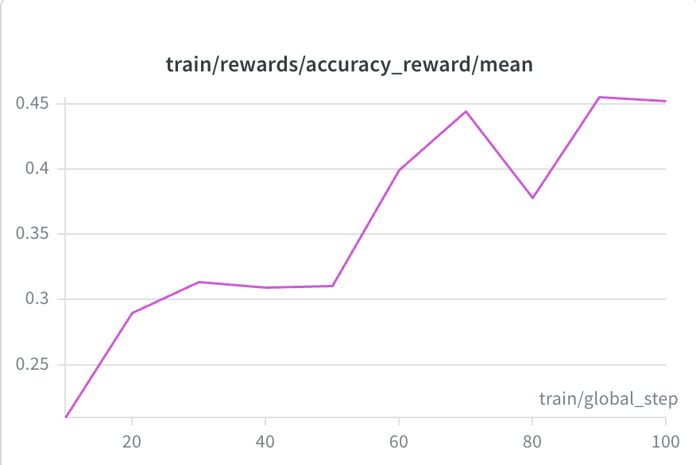
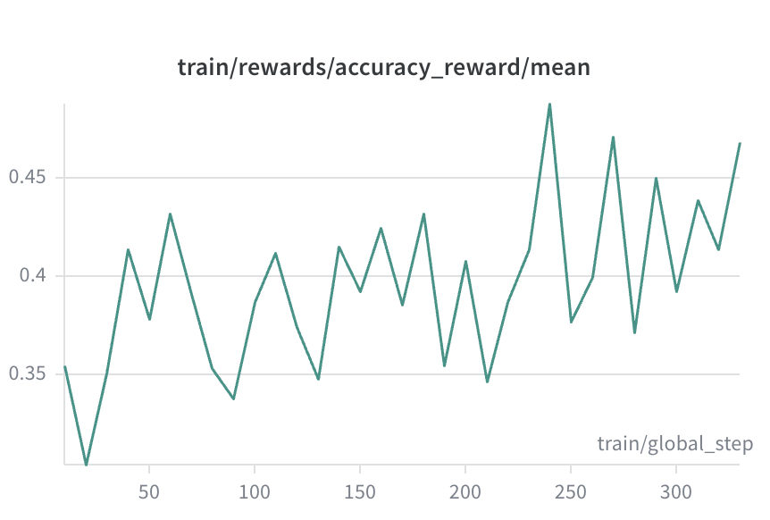
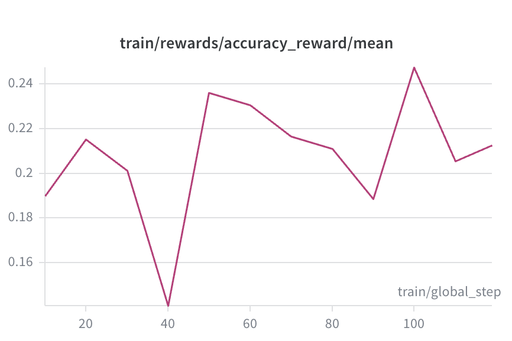
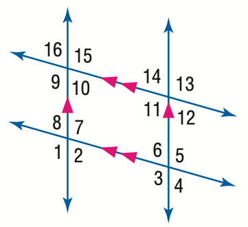
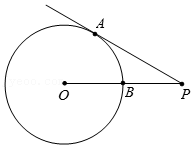
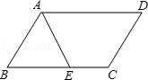
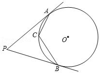
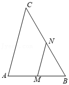

# 📐 Visual Geometry Reasoning using Qwen2.5-VL with GRPO and SFT

## 📌 Project Overview
This project implements **Group Relative Policy Optimization (GRPO)** and **Supervised Finetuning** to enhance **visual geometry reasoning** in the **Qwen2.5-VL-3B-Instruct** model. 
The training system leverages **HuggingFace TRL** for the RL loop and SFT, **LoRA** for parameter-efficient tuning, and **VLLM** for high-throughput generation during the exploration phase.

**Target Benchmark:** [MathVista](https://mathvista.github.io/)  
**Training Data:** [CASIA-PGPS9K](https://nlpr.ia.ac.cn/databases/CASIA-PGPS9K/index.html)

---
## Stage 0 Data Split and processing (Completed)
CASIA-PGPS9K has 9,022 total problems with 30 different problem types. The biggest highlight of this dataset is it includes structural and semantic clauses, which are the extracted geometric properties from the images. This can be very helpful for improving model's visual grounding capability. Some questions share the same geometry images. To avoid data leakage, I used group-level split: all the questions that share the same image belong to the same split. At the same, I made sure the training, validation and test splits have similar ratios of problem types. The split result is:
- Training data: 7,500 problems (3,311 unique diagrams)
- Validation data: 514 problems (217 unique diagrams)
- Test data: 1,007 problems (440 unique diagrams)
I also did additional data processing including the following:
- Some of the original questions use latex expressions. These questions are converted to natural language questions
- The structural and semantic clauses are written in a special annotation. I converted these clauses to functional annotation.
- The ground truth answers in CASIA-PGPS9K are float numbers to three decimals. I wrote a script that compares decimal numbers v.s. fractional numbers and answers with symbols such as \sqrt, \pi etc.

## Stage 1 Baseline Evaluation (Completed)
- Prompt the model to output solution in <think>...</think><answer>...</answer> format
- Utilize latex2sympy2 library for answer comparison
- Evaluated baseline model's accuracy  

## Stage 2 SFT (In Progress)

## Stage 3 GRPO

## Stage 4 Benchmark Evaluation
GRPO (Completed)
The goal is to bootstrap the model's reasoning capabilities by strictly enforcing a structured output format:
`<think>...reasoning steps...</think><answer>...final answer...</answer>`

### The Reward Function
To penalize "shortcut learning" (guessing without reasoning) while maintaining training stability, I implemented a hierarchical reward function.

R(y) = 1.0 if if Correct Answer AND Strict Format; 0.1 if Incorrect Answer BUT Strict Format; 0.0 otherwise

---

### Data Engineering & Curriculum
This project moves beyond simple dataset loading by implementing a **Curriculum Learning** strategy based on problem complexity.

### Data Processing Pipeline
* **Normalization:** Converted VLAA-GeoQA's multiple-choice format `(A/B/C/D)` into open-form expressions.
* **Math Standardization:** Normalized all ground truth values to standard LaTeX math expressions using `math_verify` equivalence checks.
* **Difficulty Stratification:** Classified VLAA examples into 3 tiers based on reasoning length and ground-truth complexity:
    * **Tier 1 (Easy):** Bottom 30% difficulty
    * **Tier 2 (Medium):** 30%-70% difficulty
    * **Tier 3 (Hard):** Top 30% difficulty

### Experiments & Results Analysis
The curriculum learning is divided into three phases: phase 1 trains on all difficulty 1 questions; phase 2 difficulty 2 questions and phase 3 difficulty 3 questions. Each phase trains on 1 epoch only. I experimented with training for more than 1 epoch for each phase, and found out that the accuracy and reward did not further improve after 1 epoch. This is likely because the model recognizes the problems it has seen in the first epoch and starts to shortcut the reasoning and directly output answers. 
Weights and Bias charts on rewards of the three phases shows the model keeps improving over the three phases.
| Phase 1 | Phase 2 | Phase 3 |
| :---: | :---: | :---: |
|  |  |  |

At the end of each phase, the model is evaluated on 300 validation examples. The results are as following. It shows that the model learns faster on the synthesis data. This makes sense because synthesis problems are easier: the model needs to recognize a function graph and write the function equations, or calculate the volume of 3D shapes, whereas geometry problems requires the model to recognize spatial relatioships and details in geometric shapes. In Phase 3, I drastically reduced the number of synthesis examples to focus on geometry problems (about 10% synthesis problems and 90% geometry problems), and interestingly, the accuracy on synthesis problems kept improving. 
| Metric | Phase 1| Phase 2| Phase 3|
| :--- | :---: | :---: | :---: |
| **Accuracy** | 47.0% | 53% | 57% |
| **Parse success rate** | 98.33% | 99.33%| 99.33% |
| **Average completion length** | 369 | 346 | 317 |
| **reward_by_source/geoqa** | 0.429 | 0.468 | 0.491 |
| **reward_by_source/synthesis** | 0.631 |0.711 | 0.756|
| **accuracy/geoqa/difficulty 1** | 0.5098 | 0.5490 | 0.5490 |
| **accuracy/geoqa/difficulty 2** | 0.3594 | 0.4219 | 0.4375 |
| **accuracy/geoqa/difficulty 3** | 0.2292 | 0.2500 | 0.3125 |
| **accuracy/synthesis/difficulty 1** | 0.6512 | 0.7442 | 0.7209 |
| **accuracy/synthesis/difficulty 2** | 0.5893 | 0.6250 | 0.7321 |
| **accuracy/synthesis/difficulty 3** | 0.5263| 0.6842 | 0.7368 |
| **reward/geoqa/difficulty 1** | 0.559  | 0.594  | 0.594  |
| **reward/geoqa/difficulty 2** | 0.419 | 0.477  | 0.492 |
| **reward/geoqa/difficulty 3** | 0.304 | 0.323 | 0.381|
| **reward/synthesis/difficulty 1** | 0.686 | 0.770 | 0.749  |
| **reward/synthesis/difficulty 2** |0.627| 0.663 | 0.757 |
| **reward/synthesis/difficulty 3** | 0.574 | 0.716| 0.763|

At the end of phase 3, the baseline model and the trained model are evaluated on the test dataset of 1000 examples. This further confirms that the model learns synthesis data better. 

| Metric | Phase 1| Phase 2|
| :--- | :---: | :---: |
| **Accuracy** | 36.0% | 55.2% |
| **parse_success_rate** | 93.0% | 98.6% |
| **Average completion length** |270| 344 |
| **reward_by_source/geoqa** | 0.446 | 0.484 |
| **reward_by_source/synthesis** | 0.363 | 0.729 |
| **accuracy/geoqa/difficulty 1** | 0.5621 | 0.5740 |
| **accuracy/geoqa/difficulty 2** | 0.3581 | 0.4326|
| **accuracy/geoqa/difficulty 3** | 0.2609 | 0.2733 |
| **accuracy/synthesis/difficulty 1** |0.4167 | 0.7847 |
| **accuracy/synthesis/difficulty 2** |0.3548| 0.6989 |
| **accuracy/synthesis/difficulty 3** | 0.2400| 0.6000|
| **reward/geoqa/difficulty 1** | 0.595  | 0.614  |
| **reward/geoqa/difficulty 2** | 0.416 | 0.487  |
| **reward/geoqa/difficulty 3** | 0.330 | 0.344 |
| **reward/synthesis/difficulty 1** | 0.437 | 0.806|
| **reward/synthesis/difficulty 2** |0.372| 0.728 | 
| **reward/synthesis/difficulty 3** | 0.266 | 0.640|

I sampled some geometry problems that the model got wrong, and found two patterns. 
#### Pattern 1: Hallucination
- Sample problem 1:
In the figure, angle 1 = 123. Find the measure of angle 6

The model's states that angle 1 and angle 6 are vertically opposite angles. Vertically opposite angles are always equal. Therefore, angle 6 = angle 1 = 123. This is clearly wrong because angle 6 = 180 - angle 1. 
- Sample problem 2:
In the given figure, point P is an external point to circle O. PA is a tangent line to circle O, with A as the point of tangency. Line PO intersects circle O at point B, and angle P is 30 degrees. If BP is 2 units long, what is the length of segment AP?

The model's output says "Given that PA is a tangent to the circle at point A, we know that OA is perpendicular to PA. Therefore, angle OAP is 90 degrees. Since angle P is 30 degrees, angle APO is 60 degrees". Angle P and angle APO are essentially the same angles, but the model confused them together. 

- Sample problem 3:
Consider the given figure, where AB is parallel to CD, and CE bisects angle ACD. Let's represent angle A as variable h, where h = 108°. What is the numerical value of angle BEC?

The model states that "since AB \parallel CD, angle BEC = angle ECD = 36 degrees". Clearly this is wrong. 

The sampled problems above show the limitations of Qwen-2.5-VL-3B model, when doing mathematical reasoning, it fails to correctly identify the relationships in the geometry images and starts to hallucinate. 

#### Pattern 2: Lack of knowledge
The model may have latent knowledge about geometry and it failed to use such knowledge in its reasoning
- Sample problem 1:
can you solve this question" In the given diagram, points PA and PB are tangents to circle O at A and B, and angle P measures 70°. If point C lies on circle O, what is the measure of angle ACB?

The model was able to correctly calculate the angle of AOB on the minor arc and the angle of AOB on the major arc. However, it failed to use the inscribed angle theorem, and started hallucinating angle AOC is equal to angle COB, which is not necessarily true.

- Sample problem 2:
Consider the given diagram, where line segment AB has a length of 'p' units (p = 6). Point C is a point located outside of line segment AB, and the measure of angle ACB is 'q' degrees (q = 45°). The midpoints of AB and BC are. What is the maximum length of line segment MN?

This problem requires using the Law of Sines, but the model failed using this theorem and simply said the maximum is achieved when AC is perpendicular to AB. Although this is correct,  but the reasoning has gaps and it seems this conclusion comes out of nowhere. 

## Stage 2: Supervised Finetuning (In progress)
Based on the two patterns found, the solutions are clear: we need the model to have visual grounding and cite theorems. Instead of more GRPO, a better approach should be Supervised Finetuning. 

