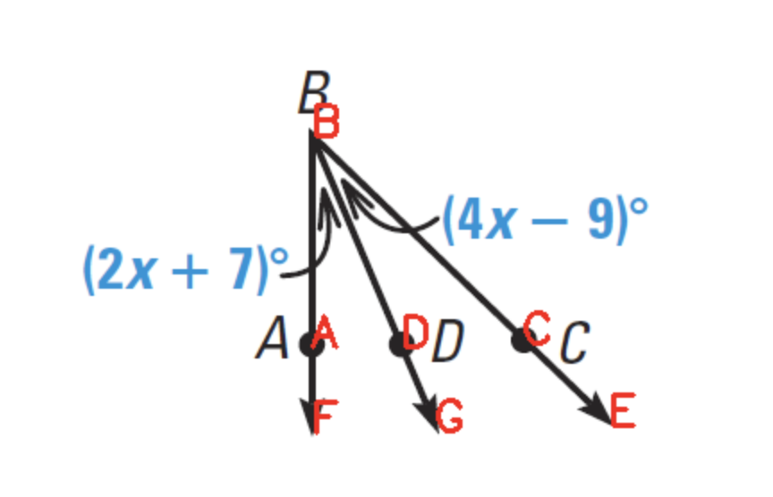
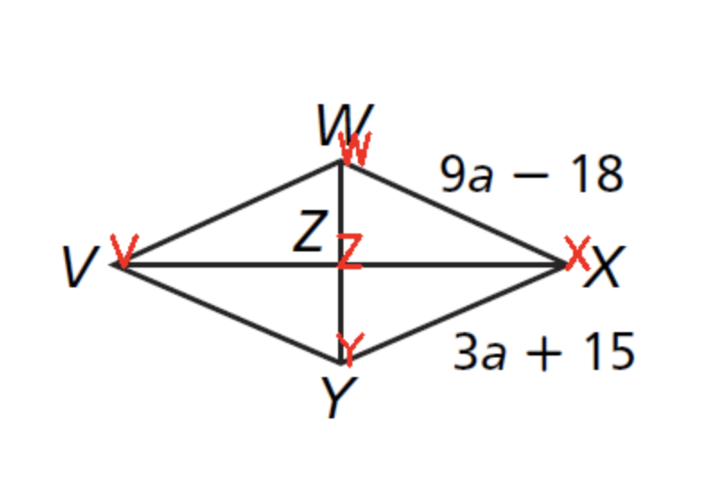
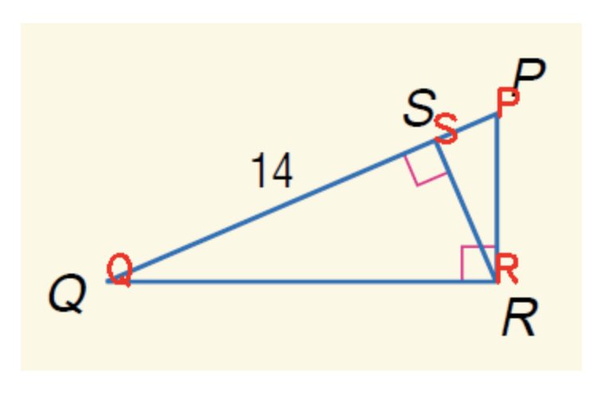
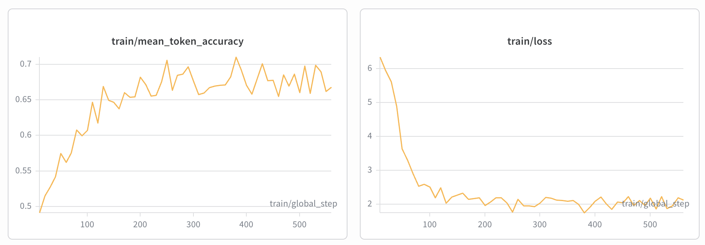

# 📐 Visual Geometry Reasoning using Qwen2.5-VL with GRPO and SFT


## 📌 Project Overview
This project implements **Group Relative Policy Optimization (GRPO)** and **Supervised Finetuning** to enhance **visual geometry reasoning** in the **Qwen2.5-VL-3B-Instruct** model. 
The training system leverages **HuggingFace TRL** for the RL loop and SFT, **LoRA** for parameter-efficient tuning, and **VLLM** for high-throughput generation during the exploration phase.

**Target Benchmark:** [MathVista](https://mathvista.github.io/)  
**Training Data:** [CASIA-PGPS9K](https://nlpr.ia.ac.cn/databases/CASIA-PGPS9K/index.html)

---
## Stage 0 Data Split and processing (Completed)
CASIA-PGPS9K has 9,022 total problems with 30 different problem types. The biggest highlight of this dataset is it includes structural and semantic clauses, which are the extracted geometric properties from the images. This can be very helpful for improving model's visual grounding capability. Some questions share the same geometry images. To avoid data leakage, I used group-level split: all the questions that share the same image belong to the same split. At the same, I made sure the training, validation and test splits have similar ratios of problem types. The split result is:
- Training data: 7,500 problems
- Validation data: 513 problems 
- Test data: 1,007 problems

I also did additional data processing including the following:
- Some of the original questions use latex expressions. These questions are converted to natural language questions
- The structural and semantic clauses are written in a special annotation. I converted these clauses to functional annotation.
- The ground truth answers in CASIA-PGPS9K are float numbers to three decimals. I wrote a util script that leverages latex2sympy2 library to compare decimal numbers v.s. fractional numbers and answers with symbols such as \sqrt, \pi etc.

## Stage 1 Baseline Evaluation (Completed)
To evaluate the baseline model:
- Prompt the model to output solution in \<think>...\</think>\<answer>...\</answer> format
- Utilize  library for answer comparison
- Evaluated baseline model's accuracy on both validation data and test data.

Results:
- Validation data: Overall Accuracy: 114/514 (22.2%); Parse Success Rate: 83.5%
- Test data: Overall Accuracy: 226/1007 (22.4%); Parse success rate: 83.8%

Model's accuracy broken down by problem type (ordered in ascending order):
| Problem Type | Accuracy |
|---|---|
| Angle Bisector of Triangle | 0% |
| Geometric Mean| 0% |
| Polygon Angle| 0% |
| Circle Chord| 5% |
| Secant Angle  | 6% |
| Secant Segment   | 7% |
|Tangent    | 8% |
|  Inscribed Angle| 10% |
| Rhombus and Square| 14% |
| Median of Triangle| 14% |
| Similarity in Parallel Line| 15% |
| Perpendicular Bisector of Triangle| 20% |
| Isosceles (Equilateral) Triangle| 21% |
| Trigonometry| 22% |
| Parallelogram| 25% |
| Polygon Congruence | 25% |
| Pythagorean Theorem| 25% |
| Midsegment of Triangle| 27% |
| Angle Relation in Triangle| 29% |
| Trapezoid and Kite| 29% |
| Circumference and Area of Circle| 29% |
| Parallel Lines    | 31% |
| Line Segment  | 33% |
| Perimeter and Area of Polygon| 33% |
|  Polygon Similarity| 35% |
| Arc Angle | 36% |
| Perimeter and Area of Quadrangle| 37% |
| Rectangle | 38% |
| Angle| 39% |
| Perimeter and Area of Triangle| 44% |

By looking at individual problems that the model was wrong on, I have found  failure patterns:

### 1. Visual hallucination
exampl question: BD bisects angle ABC. Find the measure of angle DBC.


The model correctly identifies 2x+7 and 4x-9 in the image, but hallucinate that there is a triangle in the image, and states "The sum of angles in a triangle is 180 degrees. Therefore, angle ABD + angle CBD + angle DBC = 180"

### 1. Geometry relationship confusion
example question: VWXY is a rhombus. Find angle WXY if angle WVY = 4b+10 and angle XZW = 10b-5


The model correctly recognizes that "because VWXY is a rhombus, all sides are equal" and "The diagonals of a rhombus bisect each other at right angles", but it incorrectly identifies the relationship between angles. It states "angle WVY and angle XZW are complementary angles"


### 3. Theorem misapplication (or blindness)
example question: In triangle PQR, PS=8, QS=14. Find RS.


The model does not know geometric mean theorem and tried to use Pythagorean theorem to solve the question, and got the wrong answer

The failure analysis above shows that the model needs to learn visual grounding and geometry theorems to improve its geometry problem solving ability. SFT is the best option. 

## Stage 2 SFT (Completed)
To address the failure patterns above, I used 1500 training examples and for each example, train the model on 3 tasks:
- task 1 visual grounding: give the model geometry image, and prompt it to output a list of visual facts
- task 2 reasoning: give the model the question text and a list of gold visual facts, prompt the model to output thinking steps and final answer in the \<think>step 1:..., step 2:...\</think>\<answer>...\</answer> format. The model should use the visual facts and apply relevant theorems.
- task 3 end-to-end: give the model the image and the question text, prompt the model to output thinking steps and final answer in the \<think>step 1:..., step 2:...\</think>\<answer>...\</answer> format. The model should output visual facts on its own and apply relevant theorems.

The SFT ran for 2 epochs to avoid overfitting. Based on the analysis in stage 1, the model is weak on the problem types such as Angle Bisector of Triangle, Geometric Mean, Polygon Angle, Circle Chord, Secant Angle, Secant Segment, Tangent, and Inscribed Angle. I used stratified sampling to increase the ratio of these problem types in the SFT training data. 
The loss curve and mean token accuracy shows the model is improving 


The evaluation result on the validation dataset shows:
### accuracy and format compliance:
| Metric | Baseline | SFT (ckpt-564) | Delta |
|---|:---:|:---:|:---:|
| **Reasoning accuracy** | 23.6% (121/513) | 19.9% (102/513) | -3.7% |
| **End-to-end accuracy** | 20.5% (105/513) | 18.1% (93/513) | -2.4% |
| Reasoning format compliance | 0.0% | 83.2% | +83.2% |
| Reasoning step numbering | 0.0% | 84.0% | +84.0% |
| End-to-end format compliance | 0.0% | 86.4% | +86.4% |
| End-to-end step numbering | 0.0% | 87.1% | +87.1% |

### visual grounding
| Metric | Baseline | SFT (ckpt-564) | Delta |
|---|:---:|:---:|:---:|
| Format compliance | 92.4% | 98.6% | +6.2% |
| Avg facts predicted | 120.3 | 46.6 | (gold: 8.2) |
| Facts within ±3 of gold | 276/513 (53.8%) | 437/513 (85.2%) | +31.4% |
| Median output tokens | 146 | 72 | -50.7% |

### output token length
| Task | Baseline (median) | SFT (median) |
|---|:---:|:---:|
| Visual grounding | 146 | 72 |
| Reasoning | 270 | 509 |
| End-to-end | 239 | 445 |

### analysis
#### 1. SFT dramatically improves format compliance at the cost of accuracy

The baseline model never produces the target structured format (`<think>Step 1:...Step 2:...</think><answer>...</answer>`), achieving 0% format compliance. The SFT checkpoint produces correctly formatted output ~84-87% of the time. However, this comes with a 2-4% accuracy drop across reasoning and end-to-end tasks.

#### 2. Visual grounding is substantially better after SFT
The baseline severely over-generates facts (mean 120 vs gold 8), often getting stuck in repetition loops that produce thousands of repeated tokens. The SFT model is much more calibrated (mean 47, median matching gold at 8), with 85% of predictions within ±3 of the gold fact count vs 54% for baseline.

#### 3. The accuracy changes are not uniform — the two models have meaningful complementarity:
**Reasoning task:**
| | Baseline correct | Baseline wrong |
|---|:---:|:---:|
| **SFT correct** | 59 | 43 |
| **SFT wrong** | 62 | 349 |

**End-to-end task:**
| | Baseline correct | Baseline wrong |
|---|:---:|:---:|
| **SFT correct** | 42 | 51 |
| **SFT wrong** | 63 | 357 |

#### 4. Accuracy changes are driven by response length, not problem complexity
Quartile analysis by problem complexity (number of facts, variables, structural elements) showed no systematic trend where SFT performs better on more complex problems. Instead, the key predictor is **SFT response length**:

| Category | SFT median tokens | SFT mean tokens |
|---|:---:|:---:|
| Problems SFT gained (43) | 417 | 504 |
| Problems SFT lost (62) | 561 | 1,885 |
| Baseline on lost problems | 257 | 276 |

- When SFT produces a **short, focused response** (~400-500 tokens), it tends to reason correctly.
- When SFT produces a **long response** (~1,800+ tokens), it often spirals into repetitive steps, contradictions, or hits the 8K token limit (8 of 62 lost problems).

### an alternative approach
I also tried training the model in the following reponse format:
```
<think>
<facts>
[F1]...
[F2] ...
</facts>
<theorems>
[T1] ...
[T2] ...
</theorems>
<reasoning>
step 1: [T1] ... [F1]
step 2: [F2]
step 3: [T2]
</reasoning>
</think>
<answer></answer>
```
But this is too much for a 3B model to handle. I tried this approach and the accuracy on validation data dropped to 9%, and the format compliance rate was only 53%. 


## Stage 3 GRPO (In Progress)
reward function design: 

## Stage 4 Benchmark Evaluation

